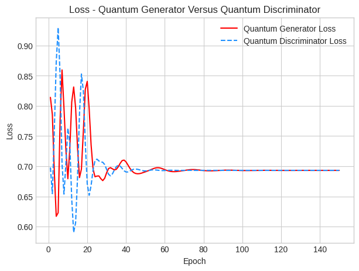
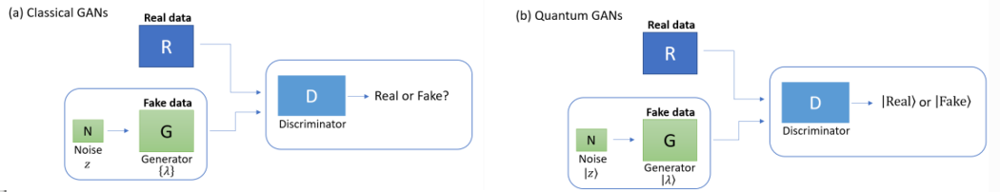

# Quantum-Generative-Adversarial-Networks-Part-1

## Introduction

Part 1 of this series on Quantum Machine Learning is an exploration of quantum generative modeling in a relatively simple case.
In this notebook we use the PennyLane Python library to create a quantum Generative Adversarial Network (QGAN) 
designed to operate on a two-qubit quantum computing device. 

The architecture of the QGAN consists of a data-preparing quantum circuit for 
generating the training state, a variational quantum generator to replicate this state, 
and a quantum discriminator tasked with differentiating between the generated and true states. 

In the figure, figure (a) depicts the foundational components of traditional Generative Adversarial Networks (GANs) 
are depicted. Here, a discriminator is tasked with identifying if the provided samples originate 
from an authentic source, denoted as R, or are generated by a generator, represented as G(z), 
which incorporates a noise source z. Conversely, figure (b) illustrates the role of a quantum 
discriminator, which is challenged to ascertain whether the quantum state presented to it is 
derived from a genuine quantum data source, R, or produced by a quantum generator, symbolized as 
G(|z>), that utilizes a quantum noise vector |z>. The outcome of the discriminator's evaluation is 
expressed as a quantum state, either |Real> for authentic sources or |Fake> for generated ones. Image adapted from 
Dallaire-Demers, Pierre-Luc, and Nathan Killoran. "Quantum generative adversarial networks." Physical Review A 98, no. 1 (2018): 012324.

## Background and Context

The synthesis of quantum computing (QC) and artificial intelligence (AI) into quantum machine learning (QML) represents a significant advancement in the ability to tackle complex problems previously considered intractable. This integration leverages quantum computers' proficiency in learning and sampling from high-dimensional probability distributions, presenting quantum generative models as a promising frontier. These models, in some cases, have shown theoretical or empirical superiority over classical algorithms, indicating their potential in areas where classical approaches face limitations.

### Classical Generative Modeling

Classical generative modeling, deeply rooted in deep learning and probabilistic modeling, has achieved considerable success 
in generating realistic images. Yet, these models face challenges such as slow sampling speeds and security concerns in 
diffusion models, difficult convergence in GANs, and the issue of generating high-quality images in VAEs. 
These limitations pave the way for the exploration of quantum generative modeling, which 
promises novel solutions through the unique capabilities of quantum mechanics.

**Variational Autoencoders (VAEs)**: Variational Autoencoders (VAEs) enable the generation of images through controlled 
mapping of data into a latent space, facilitating the creation of new images in a controlled manner. 
However, their effectiveness is somewhat limited by an inherent challenge: they primarily rely on Gaussian distributions within this 
latent space to model data. This reliance can restrict their ability to accurately 
capture complex data distributions, often resulting in images that lack realism. 
Although VAEs are proficient at learning representations in latent space, this 
limitation can hinder their performance when dealing with intricate data, leading 
to the production of images that may not always convincingly mimic reality.

**Generative Adversarial Networks (GANs)**: Generative Adversarial Networks (GANs) (introduced in 2014 by Ian Goodfellow) have shown remarkable prowess in creating visually 
compelling images via adversarial training. This technique involves two components: 
a generator and a discriminator, which engage in a strategic min-max game to craft high-quality images. 
Although GANs achieve impressive outcomes, they are notoriously challenging to train, 
grappling with problems like mode collapse—where the generator frequently produces a 
narrow variety of samples—and training instability.

**Diffusion Models (DMs)**: Diffusion Models (DMs) have gained recognition as a potent 
method for generating high-quality images, presenting a novel 
approach to image creation by gradually converting a basic 
distribution into a more intricate one. This method enhances the 
stability throughout the training process, thereby reducing the 
risk of common problems such as mode collapse or vanishing gradients. 
However, due to their iterative nature, Diffusion Models also require 
more computational resources (challenges in computational efficiency) and may sometimes produce unrealistic images 
if the denoising process does not perform as expected (denoising algorithm failures).

### Quantum Generative Modeling

**Quantum generative modeling** has gained attention with the development of algorithms like the 
Quantum Circuit Born Machine (QCBM), Quantum Boltzmann Machine, and Quantum Generative Adversarial Networks (QGANs). 
These models utilize quantum computing's inherent properties, such as superposition and entanglement, 
offering potentially more efficient representation and sampling of complex probability distributions. 
Notably, QGANs, which employ an adversarial learning approach, could achieve exponential advantages over classical counterparts in 
certain high-dimensional scenarios, as demonstrated by Loyds and Weedbrook.

Despite these advancements, quantum generative modeling is still in its nascent stages, 
requiring further real-world testing and exploration to fully understand its capabilities and limitations. 
The field promises to revolutionize generative modeling by addressing the challenges faced by classical methods, 
but its practical application and effectiveness in various domains remain to be thoroughly investigated.

### Quantum Generative Adversarial Networks

A Quantum Generative Adversarial Network (QGAN) is a GAN, with the competing discriminator and generator,
but with the additional characteristic that a part of the adversarial model is implemented by a quantum model, typically some form of
a quantum neural network.

Several variations on the QGAN have been investigated:

**Quantum Data, Quantum Generator, Quantum Discriminator**: In this variation, the system operates entirely within the 
quantum realm, with both the generator and discriminator functions executed through quantum circuits. 
This approach facilitates a distinctive Quantum GAN (QGAN) structure, characterized by its all-quantum composition. 
Given that the process involves quantum information, and every element of the GAN is built upon quantum circuits, 
it achieves seamless integration, eliminating the need for intermediary feature maps or measurement procedures within the model.

**Quantum Data. Quantum Generator. Classical Discriminator**: In this instantiation of the QGAN,
quantum information is leveraged alongside a quantum generator, but with a traditional discriminator. 
When employing a conventional discriminator, the structure of the QGAN has a closer resemblance to 
traditional GANs. In this setup, the generator is tasked with creating quantum states, 
which are subsequently converted into classical information through a measurement process. 
This conversion is necessary for the input to be compatible with the discriminator. 
Similarly, any quantum information initially present must undergo measurement.

**Classical Data. Quantum Generator or Quantum Discriminator**: In this scenarios the QGAN is most comparable to 
the classical analogs, utilizing standard data while integrating either a quantum generator or discriminator, 
or sometimes both. This approach involves substituting one or both components of the GAN with quantum versions 
that still interact with classical data inputs and outputs. Specifically, when employing a quantum discriminator, 
it necessitates the conversion of classical information into quantum states through a feature map. 
Given the broader availability of classical over quantum data, this architectural model has received 
more attention and exploration in the literaature.

## Code Description

In the Jupyter Notebook we build and train a quantum Generative Adversarial Network (QGAN) that 
operates on a quantum computing device equipped with two qubits. This QGAN comprises several key components:

**Quantum Circuit for Data Preparation**: The first component is a quantum circuit designed to prepare a specific one-qubit quantum state, denoted as |𝜓1⟩, which our QGAN will attempt to replicate. This circuit, functioning on the first qubit, serves as an access point to the quantum training data, or "true state," |𝜓1⟩. Essentially, it provides us with the necessary quantum state copies for training, akin to replicating a quantum state produced in a physics experiment.

**Quantum Generator**: The next component is the quantum generator, which operates on the same first qubit. Its goal is to generate a quantum state that closely matches the "true state" |𝜓1⟩. This generator is constructed using a variational approach, which means its behavior is determined by adjustable parameters that are optimized during training.

**Quantum Discriminator**: The final component is the quantum discriminator, which utilizes both qubits of the device. It analyzes the state present on the first qubit, which could either be the "true state" |𝜓1⟩ or a state produced by the generator. The discriminator's role is to differentiate between these two states, ensuring it has the necessary capacity to evaluate their differences by operating across two qubits. This component is also built using a variational approach but concludes with a measurement operation on the first qubit. Unlike in classical data scenarios, this setup does not require the use of feature maps, simplifying the process.

Together, these components form a quantum GAN designed to learn and replicate a specific quantum state, demonstrating a novel approach to quantum machine learning.

## Conclusion

In this study we develop a Quantum Generative Adversarial Network (QGAN) using the PennyLane Python library and PyTorch, 
designed specifically for a two-qubit quantum computing setup. The structure of the QGAN includes a quantum circuit 
for preparing data to create a training state, and a variational quantum generator that seeks to mimic this state. 
We also created a quantum discriminator to accurately differentiate between the artificial states and the actual 
states. This demonstration underscores the promising application of quantum computational techniques within 
generative adversarial networks, laying the groundwork for investigating more sophisticated quantum machine 
learning models in subsequent notebooks.

## References and Miscellaneous Notes

**Biamonte, J., Wittek, P., Pancotti, N., Rebentrost, P., Wiebe, N. and Lloyd, S., 2017. Quantum machine learning. Nature, 549(7671), pp.195-202.**

Authors conjecture that quantum systems produce atypical patterns that classical systems are thought not to produce efficiently, so it is reasonable to postulate that quantum computers may outperform classical computers on machine learning tasks. 

**Dallaire-Demers, Pierre-Luc, and Nathan Killoran. "Quantum generative adversarial networks. Physical Review A 98, no. 1 (2018): 012324.**

**Georgescu, Iulia M., Sahel Ashhab, and Franco Nori. "Quantum simulation." Reviews of Modern Physics 86, no. 1 (2014): 153.**

**Daley, Andrew J., Immanuel Bloch, Christian Kokail, Stuart Flannigan, Natalie Pearson, Matthias Troyer, and Peter Zoller. "Practical quantum advantage in quantum simulation." Nature 607, no. 7920 (2022): 667-676.**

Authors state that many of the most promising short-term applications of quantum computers fall under the umbrella of quantum simulation: modelling the quantum properties of microscopic particles that are directly relevant to modern materials science, high-energy physics and quantum chemistry. 

Quantum simulation can be performed not only on future fault-tolerant digital quantum computers but also already today through special-purpose analogue quantum simulators. 

The authors argue that a first practical quantum advantage already exists in the case of specialized applications of analogue devices, and that fully digital devices open a full range of applications but require further development of fault-tolerant hardware.

